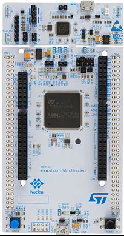

# nucleo-l4r5 — STM32L4R5ZIT6 development projects

Bare-metal projects for the **nucleo-l4r5** board (NUCLEO-L4R5ZI,
**STM32L4R5ZIT6**), built with **CMake/Ninja** (Pico-style), debugged/flashed
through an **ST-Link** over **SWD**, with `printf()` streamed out **LPUART1
(PG7/PG8)** at **115200 baud** — the ST-Link's **virtual COM port (VCP)** is the
console.



## Board facts

- MCU: **STM32L4R5ZIT6** (Cortex-M4F @ up to 120 MHz, 2 MB flash, 640 KB SRAM)
- Clock: **HSI 16 MHz** → PLL → **120 MHz** (no external crystal required)
- LEDs (all **high-active**): **LD1 green PC7**, **LD2 blue PB7**, **LD3 red PB14**
- User button: **B1 PC13**, momentary, **active-low** (`BTN_PRESSED()` = pin == 0)
- Console: **LPUART1** on **PG7 (TX) / PG8 (RX)**, AF8, **115200 8-N-1** → ST-Link VCP
  (PG7/PG8 are in the VddIO2 domain; the board layer enables VddIO2)
- SWO: **PB3** (AF0) — DWT/ITM enabled, but the UART VCP is the console
- Debug: **ST-Link** (V2/V3) over SWD; probe-rs chip name `STM32L4R5ZI`, auto-detected

## Projects (`bare/`)

| Project              | What it does |
| -------------------- | ------------ |
| `bare/blink_hello`   | Blinks the LEDs and periodically samples the **ADC1 internal channels** (VREFINT / temperature sensor / VBAT) and prints them |
| `bare/dhry_120m`     | Dhrystone 2.1, 10,000,000 runs, GCC or armclang, `-Ofast -ffp-contract=fast -funroll-loops` |
| `bare/coremark_120m` | CoreMark 1.0.1, 10,000 iterations, GCC / armclang / starm-clang, `-Ofast`-class flags |
| `bare/st7789s_md120_240x240_ft6336` | **ST7789S 1.2" 240x240** LCD (**TK012F6** module, 3-wire 9-bit serial, no D/C pin) via **HW SPI1** + **FT6336** capacitive touch over **HW I2C1**; pattern set, FPS counter, touch printout |

All projects share the board support in `board/` (120 MHz clock from the HSI,
PC7/PB7/PB14 LEDs, PC13 button, LPUART1 console, newlib stubs, ST HAL wiring)
and the CMake helpers in `cmake/`.

> ⚠ **Do not use LTO for Dhrystone.** GCC `-flto` hoists loop-invariant work
> out of the timed region and inflates the score ~2× (still passing the checks).

## Clock tree (120 MHz)

```
HSI 16 MHz → PLL (M=2, N=30, P=2, R=2) → SYSCLK 120 MHz
  AHB=120, APB1=60, APB2=120, flash latency 5, VOS1 + boost
```

## SRAM

| Region | Base         | Size   | Use |
| ------ | ------------ | ------ | --- |
| SRAM1  | `0x20000000` | 192 KB | available |
| SRAM2  | `0x10000000` | 64 KB  | available |
| SRAM3  | `0x20040000` | 384 KB | **main data + stack** (default `.data`/`.bss`/heap/stack) |

## Build / flash / serial console

```bash
cd bare/blink_hello && bash build.sh       # or: cmake -G Ninja -S . -B build && ninja -C build
ninja flash                                # probe-rs download + reset over ST-Link SWD (auto-detected)
ninja flash-reset                          # same, but connect under reset (see Troubleshooting)
```

Or flash with OpenOCD: `ninja flash-ocd`.

To pin a specific ST-Link, pass `-DDEBUG_PROBE=<selector>` at configure time
(see `probe-rs list` for the selector, e.g. `0483:3752:xxxx`). To run SWD at a
lower clock (long or noisy wiring), pass `-DDEBUG_SPEED=<kHz>`.

Read the console on the **ST-Link virtual COM port** (the ST-Link VCP shows up
as a `COMxx`): **115200 baud, 8-N-1**.

## Troubleshooting flashing

### `Target voltage (VAPP) is 0.00 V. Is your target device powered?` + `JtagGetIdcodeError`

The probe is detected but the ST-Link reads the **target supply as 0 V**, so it
cannot drive SWD. This is a **board power** problem, not firmware/tooling — no
build or `probe-rs` option can work around it. On a NUCLEO-L4R5ZI check, in
order:

1. **IDD / power jumper fitted.** The `IDD` jumper (2-pin, `JP5` on
   NUCLEO-144) connects the ST-Link's 3V3 to the MCU `VDD`. It must be **fitted**
   for normal use — it is only removed to measure current. This is the most
   common cause.
2. **VDD source jumper correct.** The `VDD`/`VDD_MCU` selector (3-pin `JP6` on
   NUCLEO-144) must select **3V3 from the ST-Link** (default). If it is set to
   `E5V`/`VIN`/`AREF` with nothing connected there, the MCU is unpowered.
3. **Power LED lit.** The red `PWR`/`LD4` LED must be on. If it is dark, the
   board is not powered.
4. **Cable in the right port, data-capable.** The cable must be in the
   **ST-Link USB** connector (`CN1`), not the USB-OTG connector. (If the probe
   *were* not detected at all, suspect the cable/port instead.)
5. **Reset the MCU / probe.** Press `B2` (reset), unplug/replug the ST-Link USB,
   and try another USB port (a powered hub can supply too little current).

Confirm from the host side with `probe-rs list` (probe present?) and
`probe-rs info --protocol swd` (does it still report `VAPP ... 0.00 V`?).

### Connect problems that *are* fixable from here

If the probe reports a sane voltage but still will not connect (e.g. the
firmware remaps the SWD pins, enters STOP/STANDBY, or the chip is wedged), use:

```bash
ninja flash-reset      # probe-rs --connect-under-reset: halts the core at reset
```

OpenOCD is the equivalent fallback: add `reset_config srst_only` plus
`reset halt` before `program` in `cmake/openocd_stm32l4r5.cfg` (or on the
`openocd` command line), and use `ninja flash-ocd`.
